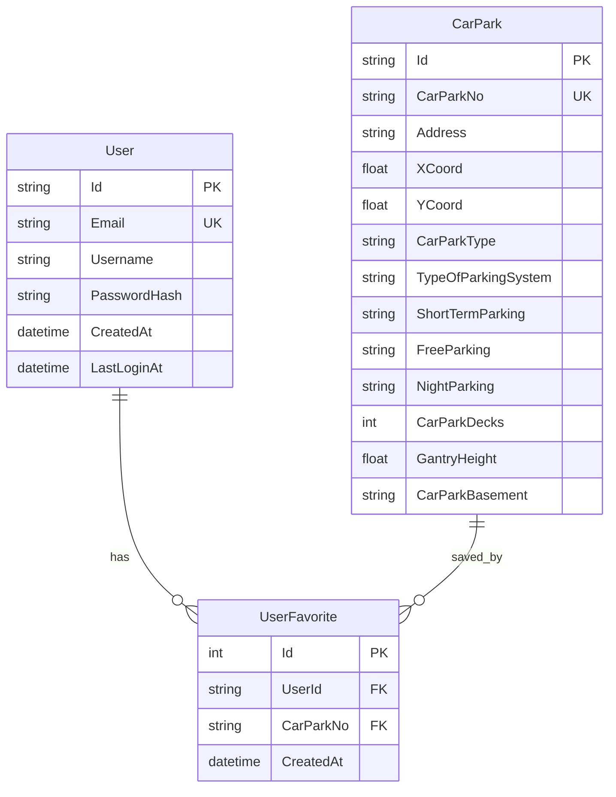

# CarPark-Info

A .NET Core backend application for managing and accessing carpark information.

## Table of Contents
- [Features](#features)
- [Tech Stack](#tech-stack)
- [Getting Started](#getting-started)
- [API Documentation](#api-documentation)
- [Authentication](#authentication)
- [Database Design & Optimization](#database-design--optimization)

## Features

### User Stories Implemented
1. **Carpark Filtering** 🔍
   - ✅ Filter carparks offering free parking
   - 🌙 Filter carparks with night parking availability
   - 📏 Filter carparks by vehicle height requirements

2. **User Features** 👤
   - ⭐ Save favorite carparks
   - 📋 Manage favorite carparks list

## Tech Stack

- **.NET Core 8.0**
  - Entity Framework Core with SQLite
  - JWT Authentication
  - Swagger/OpenAPI documentation
  - CsvHelper for CSV processing

## Getting Started

### Prerequisites
- .NET SDK 8.0
- Git

### Installation

1. Clone the repository
```bash
git clone https://github.com/s4nat/carpark-info-assignment.git
cd carpark-info-assignment
```

2. Backend Setup
```bash
# Navigate to API project
cd CarParkInfo.API

# Restore dependencies
dotnet restore

# Apply database migrations
dotnet ef database update

# Start the backend server
dotnet run
```

The application will be available at:
- Backend API: https://localhost:5005
- Swagger Documentation: https://localhost:5005/swagger

## API Documentation

### Authentication Endpoints

#### POST /api/Auth/register
Register a new user account.
```json
{
  "email": "user@example.com",
  "username": "username",
  "password": "password123"
}
```

#### POST /api/Auth/login
Login with existing credentials.
```json
{
  "email": "user@example.com",
  "password": "password123"
}
```

### Carpark Endpoints

#### GET /api/CarParks/free-parking
Get all carparks that offer free parking.

#### GET /api/CarParks/night-parking
Get all carparks that offer night parking.

#### GET /api/CarParks/by-height/{minHeight}
Get carparks that meet the minimum height requirement.

#### POST /api/CarParks/favorites/{carParkNo}
Add a carpark to user's favorites (requires authentication).

#### GET /api/CarParks/favorites
Get user's favorite carparks (requires authentication).

#### DELETE /api/CarParks/favorites/{carParkNo}
Remove a carpark from user's favorites (requires authentication).

## Authentication

The application uses JWT (JSON Web Token) for authentication:

1. **Token Generation**: Upon successful login/registration, the server generates a JWT containing:
   - User ID
   - Username
   - Email
   - Expiration time (7 days)

2. **Token Usage**: 
   - Include token in Authorization header
   - Format: `Bearer <your-token>`

3. **Protected Routes**:
   - All favorites-related endpoints require authentication
   - Token validation middleware checks for valid token

## Database Design & Optimization

### Database Schema Design

The application uses a relational database (SQLite) with the following key entities and relationships:

#### Entity Relationship Diagram



#### Key Design Decisions

1. **CarPark Entity**
   - Uses GUIDs (string Id) as primary key for scalability
   - CarParkNo is made unique to ensure data integrity
   - Maintains original data structure from CSV while adding necessary database fields

2. **User Entity**
   - Uses GUIDs for primary key
   - Email uniqueness enforced at database level
   - Includes audit fields (CreatedAt, LastLoginAt) for tracking

3. **UserFavorite Entity**
   - Junction table implementing many-to-many relationship between Users and CarParks
   - Uses auto-incrementing integer ID for simplicity
   - Includes CreatedAt for auditing purposes
   - Composite unique index on (UserId, CarParkNo) prevents duplicate favorites

#### Data Normalization
- The schema follows 3NF (Third Normal Form)
- No redundant data storage
- All non-key attributes are:
  - Fully functionally dependent on the primary key
  - Not transitively dependent on the primary key

### Query Optimization Techniques

1. **Indexing**
   - Unique index on CarPark.CarParkNo, FreeParking, NightParking and Gantry Height 
   - Enables faster querying
   - Composite index on UserFavorite (UserId, CarParkNo)

2. **Efficient Queries**
   - Use of Include() for eager loading related entities
   - Async/await for all database operations
   - Transaction management for CSV imports

3. **Data Loading**
   - Bulk operations for CSV imports
   - Transaction rollback on failure

### Security Considerations

1. **Password Security**
   - BCrypt hashing for passwords
     
2. **API Security**
   - JWT token encryption

## Contributing

Please read our [Contributing Guidelines](CONTRIBUTING.md) before submitting pull requests.

## License

This project is licensed under the MIT License - see the [LICENSE](LICENSE) file for details.
